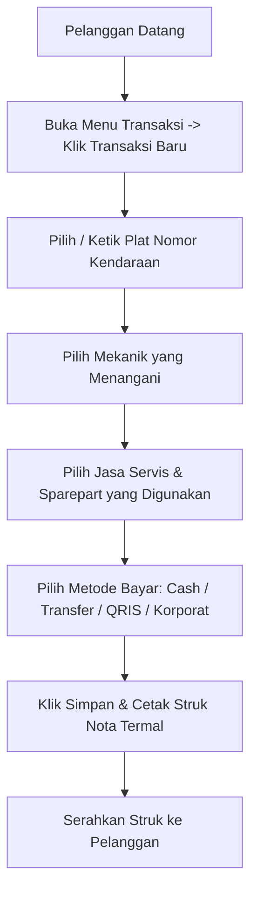
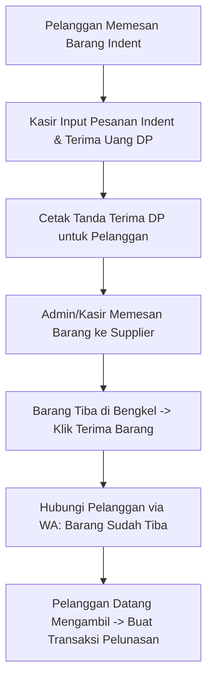

# 📘 Buku Panduan Operasional Kasir
**Sistem Informasi Bengkel & Kasir — Mulya Lestari**

---

## 📑 Daftar Isi
1. [Pengantar & Peran Kasir](#1-pengantar--peran-kasir)
2. [Login & Memulai Shift](#2-login--memulai-shift)
3. [Mengenal Antarmuka & Dashboard Kasir](#3-mengenal-antarmuka--dashboard-kasir)
4. [Transaksi Penjualan & Servis (Menu Kasir Utama)](#4-transaksi-penjualan--servis-menu-kasir-utama)
   - [Langkah 1: Membuat Transaksi Baru](#langkah-1-membuat-transaksi-baru)
   - [Langkah 2: Memilih Data Pelanggan & Kendaraan](#langkah-2-memilih-data-pelanggan--kendaraan)
   - [Langkah 3: Memilih Mekanik](#langkah-3-memilih-mekanik)
   - [Langkah 4: Menambah Jasa Servis & Sparepart](#langkah-4-menambah-jasa-servis--sparepart)
   - [Langkah 5: Metode Pembayaran (Tunai, Transfer, QRIS, Korporat)](#langkah-5-metode-pembayaran)
   - [Langkah 6: Cetak Struk Nota Kasir](#langkah-6-cetak-struk-nota-kasir)
5. [Input Barang Masuk dari Supplier (Restock)](#5-input-barang-masuk-dari-supplier-restock)
6. [Manajemen Stok Toko, Stok Gudang & Mutasi Barang](#6-manajemen-stok-toko-stok-gudang--mutasi-barang)
   - [Perbedaan Stok Toko vs Stok Gudang](#perbedaan-stok-toko-vs-stok-gudang)
   - [Cara Melakukan Transfer / Mutasi Stok](#cara-melakukan-transfer--mutasi-stok)
7. [Penanganan Barang Indent (Pre-Order Sparepart Langka)](#7-penanganan-barang-indent-pre-order-sparepart-langka)
   - [Mencatat Pesanan Indent & Menerima DP](#mencatat-pesanan-indent--menerima-dp)
   - [Penerimaan Barang Datang & Pelunasan](#penerimaan-barang-datang--pelunasan)
8. [Pelayanan Pelanggan Korporat / Instansi (Sistem Tempo)](#8-pelayanan-pelanggan-korporat--instansi-sistem-tempo)
9. [Reminder Servis Berkala via WhatsApp](#9-reminder-servis-berkala-via-whatsapp)
10. [Tutup Shift, Rekap Kas & Laporan Harian Kasir](#10-tutup-shift-rekap-kas--laporan-harian-kasir)
11. [Tanya Jawab (FAQ) & Panduan Mengatasi Kendala](#11-tanya-jawab-faq--panduan-mengatasi-kendala)

---

## 1. Pengantar & Peran Kasir

Selamat datang di **Sistem Operasional Kasir Mulya Lestari**. Buku panduan ini disusun khusus untuk membantu Anda (Kasir) menjalankan tugas operasional bengkel sehari-hari dengan cepat, tepat, dan rapi.

### 🌟 4 Tanggung Jawab Utama Kasir:
1. **Melayani Transaksi dengan Cepat & Ramah**: Mencatat servis dan penjualan sparepart secara akurat serta mencetak struk nota resmi.
2. **Menjaga Akurasi Stok Toko**: Memastikan barang yang keluar di etalase toko selalu tercatat melalui sistem transaksi kasir.
3. **Mencatat Barang Masuk (Restock)**: Menginput faktur/surat jalan dari supplier saat sparepart baru tiba di bengkel.
4. **Rekapitulasi Kas di Akhir Shift**: Menghitung uang tunai fisik di laci kasir dan memastikan kecocokannya dengan laporan harian sistem.

---

## 2. Login & Memulai Shift

### 🌐 Alamat Website Aplikasi:
Buka browser (Google Chrome disarankan) di komputer/tablet kasir:
👉 **`https://mulyalestari.my.id/login`**

```
┌────────────────────────────────────────────────────────┐
│                   MULYA LESTARI                        │
│             Sistem Informasi Kasir                     │
│                                                        │
│   Email       : [ kasir@mjl.com                      ] │
│   Password    : [ ••••••••••••                       ] │
│                                                        │
│               [   MASUK KE SISTEM   ]                  │
└────────────────────────────────────────────────────────┘
```

### Langkah-langkah Login:
1. Masukkan **Alamat Email Kasir** sesuai cabang Anda (contoh: `kasir@mjl.com` untuk Majalengka, `kasir@pku.com` untuk Pekanbaru).
2. Masukkan **Password** akun kasir Anda.
3. Klik tombol biru **"Masuk ke Sistem"**.
4. Setelah berhasil, Anda akan langsung diarahkan ke halaman **Dashboard Kasir**.

> [!TIP]
> **Simpan sebagai Bookmark**: Tekan `Ctrl + D` pada keyboard browser agar link aplikasi kasir tersimpan di bilah bookmark dan mudah dibuka setiap pagi saat menyalakan komputer.

---

## 3. Mengenal Antarmuka & Dashboard Kasir

Setelah login, Anda akan melihat tampilan kerja kasir yang bersih dan modern:

### 📊 Bagian-bagian Dashboard:
1. **Kartu Penjualan Hari Ini**: Menampilkan total uang masuk (*omzet*) hari ini dari transaksi tunai, transfer, dan QRIS.
2. **Kartu Jumlah Transaksi**: Total nota yang sudah Anda buat hari ini.
3. **Kartu Pelanggan Baru**: Jumlah data motor/mobil baru yang didaftarkan hari ini.
4. **Peringatan Stok Menipis (*Low Stock Alert*)**: Daftar sparepart di etalase toko yang jumlahnya sudah berada di bawah batas minimum (segera lakukan mutasi dari gudang!).

### 🧭 Navigasi Menu Sidebar (Kiri):
* 🏠 **Dashboard**: Ringkasan omzet dan peringatan stok.
* 🧾 **Transaksi**: Menu utama untuk membuat nota penjualan & servis.
* 👥 **Pelanggan**: Data kendaraan dan riwayat servis pelanggan.
* 📊 **Laporan**: Rekap keuangan harian untuk closing kasir.
* 🔔 **Reminder**: Daftar pelanggan yang harus diingatkan servis via WhatsApp.
* 🔧 **Jasa Servis**: Daftar tarif jasa servis di cabang Anda.
* 📦 **Sparepart**: Cek harga jual dan ketersediaan sparepart.
* 📥 **Barang Masuk**: Input barang datang dari supplier/distributor.
* 🏪 **Stock Toko**: Pantau stok sparepart di etalase depan.
* 🏬 **Stock Gudang**: Pantau stok cadangan di gudang belakang.
* 📋 **Barang Indent**: Kelola pesanan sparepart langka / pre-order & DP.
* 💼 **Korporat**: Kelola tagihan kendaraan dinas / perusahaan rekanan.
* 👨‍🔧 **Mekanik**: Daftar mekanik aktif di cabang Anda.

---

## 4. Transaksi Penjualan & Servis (Menu Kasir Utama)

Ini adalah menu yang paling sering Anda gunakan. Ikuti langkah-langkah berikut dari awal kendaraan masuk hingga struk dicetak:



---

### Langkah 1: Membuat Transaksi Baru
1. Klik menu **Transaksi** di sidebar kiri.
2. Klik tombol biru **"+ Transaksi Baru"** di pojok kanan atas.
3. Pilih **Jenis Transaksi**:
   - 🔧 **Jasa Servis Saja**: Jika hanya pengerjaan servis/ongkos pasang tanpa beli sparepart.
   - 📦 **Sparepart Saja**: Jika pelanggan hanya membeli suku cadang/oli bawa pulang tanpa diservis.
   - ⚡ **Campuran (Jasa + Sparepart)**: *(Paling Sering)* Jika ada pengerjaan servis sekaligus penggantian sparepart/oli.

---

### Langkah 2: Memilih Data Pelanggan & Kendaraan
* **Jika Pelanggan Lama**:
  - Ketik **Nomor Plat Kendaraan** (misal: `D 1234 ABC`) atau **Nama Pelanggan** pada kotak pencarian.
  - Pilih dari daftar hasil pencarian. Data kendaraan akan otomatis terisi.
* **Jika Pelanggan Baru**:
  - Klik **"+ Tambah Pelanggan Baru"**.
  - Isi form sederhana:
    - **Nama Pelanggan**: Contoh `Budi Santoso`
    - **Nomor HP / WhatsApp**: Contoh `081234567890` *(Sangat penting untuk reminder servis berkala!)*
    - **Nomor Plat**: Contoh `E 4567 XYZ`
    - **Merk & Tipe Kendaraan**: Contoh `Honda Vario 160` / `Toyota Avanza`
    - **Kilometer / Odometer saat ini**: Contoh `15.420 KM`

---

### Langkah 3: Memilih Mekanik
Pilih nama **Mekanik** yang mengerjakan kendaraan tersebut dari menu dropdown.
> *Catatan: Pencatatan nama mekanik ini penting agar sistem dapat menghitung komisi bagi hasil kerja mekanik secara akurat di akhir bulan.*

---

### Langkah 4: Menambah Jasa Servis & Sparepart

#### A. Menambah Jasa Servis:
1. Di bagian **Daftar Jasa**, ketik nama jasa pada kotak pencarian (contoh: `Servis Ringan`, `Ganti Oli`, `Tune Up`, `Turun Mesin`).
2. Klik nama jasa untuk menambahkannya ke nota.
3. Harga jasa akan otomatis terisi sesuai tarif resmi cabang Anda.

#### B. Menambah Sparepart:
1. Di bagian **Daftar Sparepart**, ketik nama sparepart atau kode SKU (contoh: `Oli MPX2`, `Kampas Rem Depan`, `Busi NGK`).
2. Perhatikan angka **Stok Toko** yang muncul di samping nama barang. Pastikan stok mencukupi.
3. Klik sparepart untuk menambahkannya ke nota.
4. Ubah kolom **Qty (Jumlah)** jika membeli lebih dari 1 pcs.

#### C. Memberikan Diskon (Opsional):
Jika ada program promo atau potongan harga khusus:
- Masukkan nominal potongan pada kolom **Diskon (Rp)**. Total nota akan otomatis terpotong.

---

### Langkah 5: Metode Pembayaran

Pilih salah satu metode pembayaran yang digunakan pelanggan:

#### 💵 1. Pembayaran Tunai (CASH):
1. Pilih opsi **CASH**.
2. Masukkan jumlah uang tunai yang diberikan pelanggan pada kolom **Uang Diterima (Rp)** (contoh: total belanja `Rp 85.000`, uang diterima `Rp 100.000`).
3. Sistem akan **otomatis menghitung uang kembalian** (`Rp 15.000`).
4. Pastikan Anda menyerahkan uang kembalian yang pas ke pelanggan.

#### 💳 2. Pembayaran Transfer Bank:
1. Pilih opsi **TRANSFER**.
2. Tunjukkan nomor rekening resmi bengkel kepada pelanggan.
3. Pastikan pelanggan menunjukkan bukti transfer berhasil sebelum nota disimpan.

#### 📱 3. Pembayaran QRIS:
1. Pilih opsi **QRIS**.
2. Arahkan pelanggan untuk men-scan barcode QRIS bengkel yang terpajang di meja kasir.
3. Cek notifikasi masuk atau minta pelanggan memperlihatkan bukti pembayaran berhasil.

#### 🏢 4. Pembayaran Korporat (Instansi / Tempo):
*(Hanya untuk kendaraan operasional kantor/perusahaan yang telah memiliki MoU kerja sama)*:
1. Pilih opsi **PENDING_CORPORATE**.
2. Tagihan ini tidak meminta uang tunai saat ini, melainkan otomatis masuk ke buku piutang tagihan korporat bulanan.

---

### Langkah 6: Cetak Struk Nota Kasir
1. Setelah pembayaran sesuai, klik tombol hijau **"Simpan & Cetak Nota"**.
2. Jendela dialog printer akan otomatis muncul di layar.
3. Pastikan printer thermal kasir menyala dan kertas terpasang.
4. Klik **Print / Cetak**.
5. Sobek struk dan serahkan ke pelanggan dengan sopan beserta uang kembalian (jika ada).

> [!NOTE]
> **Cetak Ulang Struk**: Jika kertas printer macet atau pelanggan meminta cetak ulang nota beberapa hari kemudian, buka menu **Transaksi** $\rightarrow$ cari nomor nota atau plat kendaraan $\rightarrow$ klik ikon printer 🖨️ untuk mencetak ulang kapan saja.

---

## 5. Input Barang Masuk dari Supplier (Restock)

Setiap kali sales distributor atau supplier mengirim barang sparepart ke bengkel:

```
┌────────────────────────────────────────────────────────┐
│                   TAMBAH BARANG MASUK                  │
│                                                        │
│   Nama Supplier : [ PT Astra Otoparts                ] │
│   Tanggal Datang: [ 18/08/2026                       ] │
│   No. Faktur    : [ INV-2026/08/001                  ] │
│                                                        │
│   Daftar Sparepart Diterima:                           │
│   • Oli Shell Advance AX7 0.8L (Qty: 24 pcs @ Rp42.000)│
│   • Busi Denso U24EPR9         (Qty: 50 pcs @ Rp11.500)│
│                                                        │
│   Foto Faktur   : [ Pilih Foto Faktur Supplier... ]    │
│                                                        │
│               [   SIMPAN BARANG MASUK   ]              │
└────────────────────────────────────────────────────────┘
```

### Langkah Input Restock:
1. Buka menu **Barang Masuk** di sidebar kiri.
2. Klik tombol **"+ Tambah Barang Masuk"**.
3. Isi data pengiriman:
   - **Nama Supplier**: Contoh `PT Astra Otoparts`, `CV Maju Motor`, atau `Sales Oli Pertamina`.
   - **Tanggal Datang**: Pilih tanggal penerimaan barang.
   - **Catatan / No. Faktur**: Masukkan nomor surat jalan atau faktur supplier.
4. Di bagian **Pilih Sparepart**:
   - Pilih barang yang diterima.
   - Masukkan **Jumlah Diterima (Qty)**.
   - Masukkan **Harga Beli Satuan (Rp)** sesuai faktur tagihan supplier.
   - Klik **"+ Tambah Item"** jika ada barang lain dalam faktur yang sama.
5. **Upload Bukti Nota** *(Opsional tapi sangat dianjurkan)*: Ambil foto faktur kertas supplier dan unggah sebagai arsip digital.
6. Klik **"Simpan Barang Masuk"**.
7. Stok barang di sistem akan langsung bertambah otomatis dan tercatat rapi di buku inventaris!

---

## 6. Manajemen Stok Toko, Stok Gudang & Mutasi Barang

Sistem Mulya Lestari menggunakan arsitektur **Dual-Inventory (Stok Dua Lapis)** demi menjaga kerapian fisik bengkel:

### Perbedaan Stok Toko vs Stok Gudang:

| Jenis Stok | Lokasi Fisik | Fungsi Utama | Pengurangan Otomatis |
| :--- | :--- | :--- | :--- |
| **🏪 Stok Toko** | Rak etalase kasir depan & area pengerjaan mekanik | Stok siap pakai untuk melayani pelanggan harian | **Ya**, langsung berkurang otomatis setiap kasir mencetak nota transaksi |
| **🏬 Stok Gudang** | Ruang gudang penyimpanan belakang (kardus besar) | Stok cadangan grosir agar etalase toko tidak berantakan | **Tidak berkurang** saat transaksi kasir (hanya berkurang saat dimutasi ke toko) |

---

### Cara Melakukan Transfer / Mutasi Stok (Pindah Barang):

Saat sparepart di etalase depan kasir mulai habis, Anda perlu mengambil kardus baru dari gudang belakang dan mencatat perpindahannya di sistem:

```
┌────────────────────────────────────────────────────────┐
│                   TRANSFER / MUTASI STOK               │
│                                                        │
│   Jenis Mutasi  : (•) Gudang ke Toko (Restock Etalase) │
│                   ( ) Toko ke Gudang (Retur/Simpan)    │
│                                                        │
│   Pilih Barang  : [ Oli Yamalube Matic 0.8L          ] │
│   Stok Gudang   : 48 pcs tersedia                      │
│   Jumlah Pindah : [ 12 ] pcs                           │
│   Catatan       : [ Ambil 1 dus isi 12 ke etalase    ] │
│                                                        │
│               [   KONFIRMASI PINDAH STOK   ]           │
└────────────────────────────────────────────────────────┘
```

1. Buka menu **Stock Toko** atau **Stock Transfer**.
2. Klik tombol **"+ Transfer Stok"**.
3. Pilih Jenis Perpindahan:
   - 👉 **Gudang ke Toko** *(Paling sering)*: Mengambil barang dari gudang belakang untuk dipajang di etalase kasir.
   - 👉 **Toko ke Gudang**: Mengembalikan barang dari etalase ke gudang penyimpanan.
4. Pilih nama **Sparepart** yang ingin dipindahkan.
5. Masukkan **Jumlah (Qty)** barang yang dipindahkan (misal: `12` pcs).
6. Beri catatan singkat (contoh: *Buka dus baru untuk rak depan*).
7. Klik **"Konfirmasi Pindah Stok"**.
8. Sistem akan otomatis memotong stok gudang dan menambahkan stok etalase toko detik itu juga.

---

## 7. Penanganan Barang Indent (Pre-Order Sparepart Langka)

Jika ada pelanggan mencari sparepart yang stoknya sedang habis atau barang langka yang harus dipesan khusus ke pabrik:



### 1. Mencatat Pesanan Indent & Menerima DP:
1. Buka menu **Barang Indent** di sidebar kiri.
2. Klik **"+ Tambah Pesanan Indent"**.
3. Pilih / Daftarkan data **Pelanggan** (Nama & Nomor WhatsApp).
4. Masukkan nama sparepart yang dipesan dan estimasi harga jualnya.
5. Masukkan nama supplier tujuan pemesanan.
6. Masukkan jumlah **Uang Muka / DP (Down Payment)** yang dibayarkan pelanggan (misal DP Rp 100.000).
7. Klik **Simpan & Cetak Bukti Indent** $\rightarrow$ Serahkan surat tanda terima DP ke pelanggan.

### 2. Saat Sparepart Tiba dari Supplier:
1. Buka menu **Barang Indent**.
2. Cari pesanan pelanggan tersebut $\rightarrow$ Klik tombol **"Terima Barang"**.
3. Sistem akan otomatis memasukkan barang tersebut ke dalam restock.
4. Hubungi pelanggan via WhatsApp dengan ramah bahwa sparepart pesanannya sudah tiba di bengkel dan siap dipasang/diambil.

### 3. Saat Pelanggan Mengambil Barang (Pelunasan):
1. Buka menu **Transaksi** $\rightarrow$ Buat transaksi baru untuk pelanggan tersebut.
2. Masukkan sparepart indent tadi.
3. Masukkan potongan DP yang sudah dibayar pada kolom diskon/DP.
4. Pelanggan hanya perlu membayar sisa kekurangannya. Cetak nota lunas resmi.

---

## 8. Pelayanan Pelanggan Korporat / Instansi (Sistem Tempo)

Mulya Lestari melayani perawatan armada kendaraan dari perusahaan/kantor rekanan (misal: armada ekspedisi, mobil operasional bank, atau motor dinas instansi):

### Alur Kerja Transaksi Korporat:
1. **Saat Kendaraan Dinas Masuk Servis**:
   - Buka menu **Transaksi** $\rightarrow$ Klik **+ Transaksi Baru**.
   - Di bagian pelanggan, pilih nama perusahaan korporat (contoh: `PT Telkom Akses`, `J&T Express`).
   - Masukkan nomor plat kendaraan operasional yang diservis & nama driver yang membawa kendaraan.
   - Masukkan jasa servis & sparepart yang diganti.
   - Pada metode pembayaran, pilih **PENDING_CORPORATE**.
   - Klik **Simpan Transaksi**.
   - Cetak surat jalan / bukti servis untuk ditandatangani driver perusahaan sebagai bukti pengerjaan bengkel.

2. **Mengecek Daftar Tagihan Belum Dibayar**:
   - Buka menu **Korporat** di sidebar.
   - Klik nama perusahaan $\rightarrow$ Anda dapat melihat daftar transaksi servis yang belum dibayar oleh perusahaan tersebut.

3. **Mencatat Pembayaran Tagihan Korporat**:
   - Saat bagian keuangan perusahaan mentransfer pembayaran tagihan:
   - Klik tombol **"Catat Pembayaran"** pada halaman detail korporat.
   - Masukkan nominal uang yang ditransfer (bisa bayar lunas seluruh tagihan atau cicil bertahap).
   - Masukkan bukti transfer & klik Simpan.

---

## 9. Reminder Servis Berkala via WhatsApp

Fitur ini membantu menjaga pelanggan tetap setia servis di bengkel Mulya Lestari secara rutin:

```
┌────────────────────────────────────────────────────────┐
│                   REMINDER SERVIS BERKALA              │
│                                                        │
│   • Budi Santoso (Honda Vario 160 - D 1234 ABC)        │
│     Servis Terakhir: 18 Mei 2026 (90 hari yang lalu)   │
│     Status: [ Belum Diingatkan ]                       │
│     [ 💬 Kirim Pengingat WhatsApp ]                    │
│                                                        │
│   • Siti Rahma (Yamaha NMAX - E 5678 XYZ)              │
│     Servis Terakhir: 18 Juni 2026 (60 hari yang lalu)  │
│     Status: [ Belum Diingatkan ]                       │
│     [ 💬 Kirim Pengingat WhatsApp ]                    │
└────────────────────────────────────────────────────────┘
```

### Cara Mengirim Reminder:
1. Buka menu **Reminder** di sidebar kiri.
2. Sistem otomatis menampilkan daftar pelanggan yang sudah lebih dari **30 hari, 60 hari, atau 90 hari** belum kembali servis sejak servis terakhirnya.
3. Klik tombol hijau **"💬 Kirim WhatsApp"** di samping nama pelanggan.
4. Browser akan otomatis membuka WhatsApp Web / Aplikasi WhatsApp dengan **isi pesan sopan dan profesional yang sudah otomatis terisi**:
   > *"Halo Bpk/Ibu Budi Santoso, kendaraan Anda Honda Vario 160 (D 1234 ABC) sudah memasuki jadwal servis berkala / ganti oli rutin berikutnya di Bengkel Mulya Lestari. Yuk rawat motor kesayangan Anda agar performa tetap prima. Ditunggu kedatangannya ya! 🙏"*
5. Anda cukup menekan tombol **Kirim / Enter** di WhatsApp. Sangat cepat dan mudah!

---

## 10. Tutup Shift, Rekap Kas & Laporan Harian Kasir

Setiap kali shift kasir berakhir atau saat toko tutup sore/malam hari, kasir wajib melakukan proses *Closing*:

```
┌────────────────────────────────────────────────────────┐
│             REKAP PENUTUPAN KASIR (CLOSING)            │
│             Tanggal: 18 Agustus 2026                   │
│                                                        │
│   Total Transaksi Selesai : 24 Nota                    │
│                                                        │
│   💵 Kas Masuk Tunai (CASH) : Rp 2.450.000             │
│   💳 Kas Non-Tunai (TF/QRIS): Rp 1.820.000             │
│   🏢 Tagihan Korporat (Tempo): Rp   650.000            │
│   ─────────────────────────────────────────────        │
│   TOTAL OMZET HARI INI      : Rp 4.920.000             │
│                                                        │
│   Uang Tunai Fisik di Laci  : Rp 2.450.000 (Cocok ✅)  │
└────────────────────────────────────────────────────────┘
```

### Langkah-langkah Closing Harian:
1. Buka menu **Laporan** di sidebar kiri.
2. Pastikan filter tanggal memilih **Hari Ini**.
3. Cek rincian total penerimaan:
   - **Total Kas Tunai (CASH)**: Hitung seluruh uang kertas & koin fisik yang ada di dalam laci kasir. Jumlah fisik uang **WAJIB SAMA** dengan angka kas tunai di sistem.
   - **Total Non-Tunai (Transfer/QRIS)**: Pastikan seluruh bukti transfer & mutasi QRIS sudah sesuai.
4. Cetak atau screenshot ringkasan laporan harian ini.
5. Serahkan uang fisik beserta laporan harian ke Kepala Cabang / Pimpinan Bengkel.

---

## 11. Tanya Jawab (FAQ) & Panduan Mengatasi Kendala

#### ❓ Tanya: Bagaimana jika salah ketik jumlah barang saat transaksi dan nota sudah terlanjur disimpan?
> **Jawab**: Hubungi Super Admin cabang Anda untuk melakukan penyesuaian transaksi atau pembatalan nota yang salah, lalu buat transaksi baru yang sudah diperbaiki.

#### ❓ Tanya: Printer thermal kasir tidak mau mencetak struk, apa solusinya?
> **Jawab**:
> 1. Pastikan kabel USB printer thermal terhubung kencang ke komputer.
> 2. Pastikan lampu indikator printer menyala (warna biru/hijau) dan kertas roll thermal tidak habis.
> 3. Coba matikan printer selama 5 detik lalu nyalakan kembali (*restart printer*).
> 4. Buka menu **Transaksi** $\rightarrow$ cari nota terkait $\rightarrow$ klik tombol **Cetak Ulang**.

#### ❓ Tanya: Saat mencari sparepart di kasir, stoknya tertulis 0 padahal barang fisiknya ada di bengkel. Kenapa?
> **Jawab**:
> Hal ini terjadi karena barang tersebut baru datang dan belum di-input di menu **Barang Masuk (Restock)**, atau barang tersebut masih berada di **Stok Gudang** dan belum dimutasi ke **Stok Toko**. Silakan lakukan **Transfer Stok (Gudang ke Toko)** terlebih dahulu.

#### ❓ Tanya: Apakah kasir bisa melihat data transaksi milik cabang lain?
> **Jawab**:
> **Tidak bisa**. Demi privasi dan keamanan operasional masing-masing cabang, akun kasir hanya memiliki hak akses untuk melihat data stok, pelanggan, dan transaksi di cabangnya sendiri.

---

**Bengkel Mulya Lestari — Maju Bersama Pelayanan Terbaik!** 🔧🚗
*Dokumentasi Sistem Versi 1.0 — 2026*
