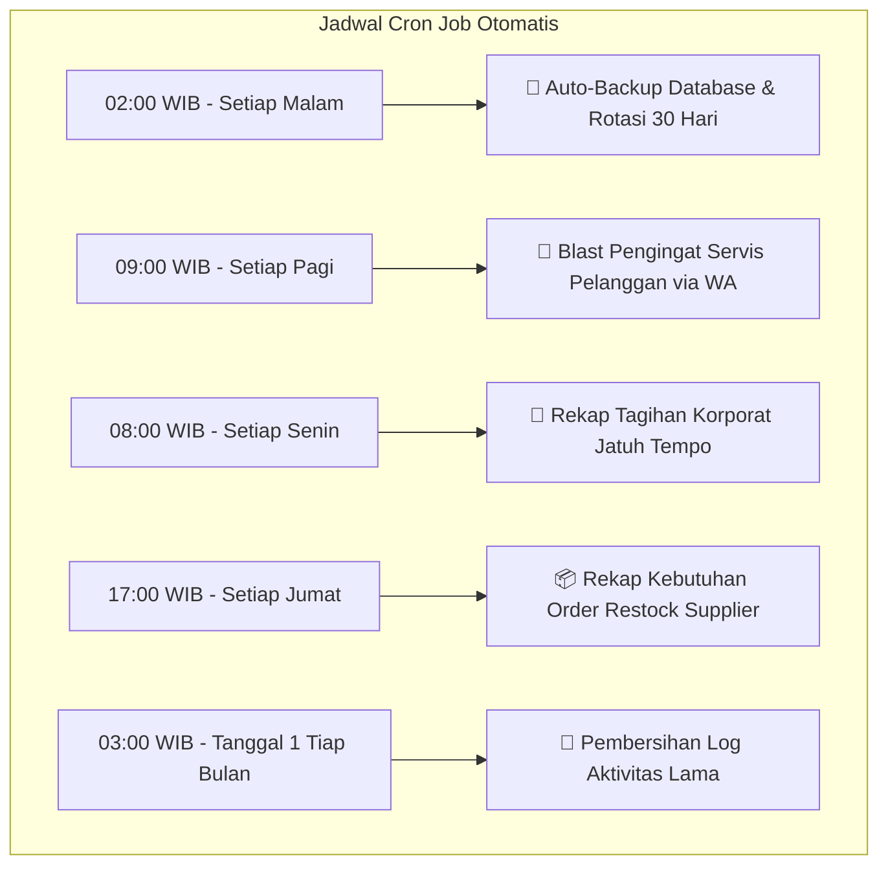

# ⏰ Perencanaan Fitur Cron Job & Otomatisasi Sistem
**Sistem Informasi Manajemen Bengkel — Mulya Lestari**

Dokumen ini disusun sebagai bahan diskusi dan pertimbangan bersama **Pemilik Bengkel (Owner)** mengenai rencana penerapan tugas otomatis (*Cron Jobs / Scheduled Tasks*) pada server VPS untuk meningkatkan efisiensi operasional, keamanan data, dan omzet bengkel.

---

## 🎯 1. Ringkasan Eksekutif

Saat ini, seluruh proses di aplikasi (pencatatan servis, backup database, pengecekan stok, dan pengiriman reminder WhatsApp) berjalan secara **on-demand (manual oleh kasir/admin)**.

Dengan menerapkan **Cron Job**, server VPS dapat menjalankan tugas-tugas rutin di latar belakang (*background*) secara otomatis pada jam-jam yang ditentukan tanpa perlu campur tangan manusia.

### 🌟 Manfaat Utama bagi Pemilik Bengkel:
1. **Keamanan Data Tanpa Beban**: Database otomatis dibackup setiap malam tanpa risiko admin lupa mengunduh file cadangan.
2. **Peningkatan Omzet Servis Berkala**: Pelanggan otomatis diingatkan saat motor/mobilnya sudah waktunya ganti oli atau servis rutin.
3. **Kontrol Piutang Korporat Lebih Ketat**: Notifikasi otomatis saat tagihan armada perusahaan rekanan sudah melewati batas tempo.
4. **Pencegahan Kehabisan Stok (*Stock-Out*)**: Rekap sparepart yang menipis otomatis dibuat sebelum akhir pekan.

---

## 📋 2. Usulan 5 Skenario Cron Job



---

### 💾 Skenario 1: Auto-Backup Database Harian (Prioritas Tinggi 🔴)

* **Jadwal Eksekusi**: Setiap hari pukul **02.00 WIB** (saat bengkel tutup & tidak ada transaksi).
* **Cara Kerja**:
  1. Server VPS otomatis mengekspor seluruh database MariaDB (`mysqldump` / JSON Snapshot).
  2. File backup dikompresi menjadi file `.sql.gz` dengan penamaan tanggal (contoh: `backup_mulyalestari_2026-08-18.sql.gz`).
  3. Disimpan di folder aman `/var/backups/mulya-lestari/`.
  4. Sistem otomatis menghapus file backup yang usianya sudah **lebih dari 30 hari** (*backup rotation*) agar kapasitas SSD VPS tidak penuh.
* **Biaya**: **Rp 0 (Gratis)** — Menggunakan fitur bawaan Linux VPS SumoPod.
* **Rekomendasi**: **Sangat Direkomendasikan Segera Diaktifkan.**

---

### 💬 Skenario 2: Auto-Blast Reminder Servis WhatsApp (Prioritas Menengah 🟡)

* **Jadwal Eksekusi**: Setiap hari pukul **09.00 WIB**.
* **Cara Kerja**:
  1. Sistem memindai pelanggan yang riwayat servis terakhirnya sudah genap **30 hari (1 bulan)**, **60 hari (2 bulan)**, atau **90 hari (3 bulan)**.
  2. Sistem menyusun pesan pengingat yang ramah dan menyebutkan nama pelanggan serta plat kendaraannya.
  3. Pesan otomatis dikirimkan ke nomor WhatsApp pelanggan melalui integrasi **WhatsApp API Gateway** (seperti *Fonnte* / *Wablas*).
* **Opsi Alternatif**:
  * **Opsi A (Otomatis Penuh)**: Memerlukan langganan WA Gateway (biaya mulai dari ~Rp 50.000/bulan).
  * **Opsi B (Semi-Otomatis / Gratis)**: Tetap seperti sekarang, di mana kasir membuka menu Reminder lalu klik tombol kirim WhatsApp manual 1 per 1 via WhatsApp Web.

---

### 🏢 Skenario 3: Peringatan Tagihan Korporat Jatuh Tempo (Prioritas Menengah 🟡)

* **Jadwal Eksekusi**: Setiap hari **Senin pukul 08.00 WIB**.
* **Cara Kerja**:
  1. Sistem memeriksa transaksi korporat yang statusnya masih belum lunas (*unpaid / pending corporate*).
  2. Jika transaksi sudah melebihi 30 hari sejak tanggal servis, sistem akan merangkum daftar perusahaan dan total tagihannya.
  3. Ringkasan tagihan dikirimkan via WhatsApp / Email ke Pemilik Bengkel dan Bagian Keuangan.
* **Manfaat**: Menghindari piutang macet dari rekanan armada kantor.

---

### 📦 Skenario 4: Rekap Kebutuhan Order Restock Mingguan (Prioritas Rendah 🟢)

* **Jadwal Eksekusi**: Setiap hari **Jumat pukul 17.00 WIB**.
* **Cara Kerja**:
  1. Sistem mengecek seluruh sparepart yang jumlah totalnya (Stok Toko + Stok Gudang) sudah $\le$ batas minimum stok (*min_stock*).
  2. Sistem membuat daftar rekomendasi belanja sparepart beserta estimasi modal belanja ke supplier.
  3. Laporan siap dicetak atau dikirimkan ke sales distributor di awal pekan.

---

### 🧹 Skenario 5: Pembersihan Log Aktivitas Sistem (Maintenance 🟢)

* **Jadwal Eksekusi**: Tanggal **1 setiap awal bulan pukul 03.00 WIB**.
* **Cara Kerja**:
  1. Menghapus log audit aktivitas pengguna (*Activity Logs*) yang usianya sudah lebih dari **90 hari**.
  2. Melakukan optimasi tabel database (*OPTIMIZE TABLE*) agar query pencarian kasir tetap responsif dan cepat.

---

## 📊 3. Analisis Biaya & Kebutuhan Server (Cost & Impact)

| Fitur Otomatisasi | Beban Server VPS | Biaya Tambahan | Dampak Bisnis |
| :--- | :---: | :---: | :--- |
| **1. Auto Backup Harian** | Sangat Ringan (< 1% CPU) | **Rp 0 (Gratis)** | Menjamin keamanan aset data 100% |
| **2. Auto Reminder WhatsApp** | Sangat Ringan | Opsional (~Rp 50k/bln jika auto-blast) | Meningkatkan kunjungan servis berkala |
| **3. Alert Tagihan Korporat** | Sangat Ringan | **Rp 0 (Gratis)** | Mempercepat penagihan piutang |
| **4. Rekap Restock Mingguan** | Sangat Ringan | **Rp 0 (Gratis)** | Mencegah kehabisan stok fast-moving |
| **5. Pembersihan Log Bulanan** | Sangat Ringan | **Rp 0 (Gratis)** | Database tetap ringan dan ngebut |

---

## 🗺️ 4. Tahapan Rekomendasi Implementasi (Roadmap)

Jika pemilik bengkel menyetujui, berikut urutan implementasi bertahap yang paling aman dan efisien:

```
Tahap 1 (Langsung Diterapkan):
  └─ Pasang Auto-Backup Database Harian di VPS (Gratis, Aman, Tidak Mengubah Kode)

Tahap 2 (Setelah Pembahasan Alur Bisnis):
  ├─ Pasang Rekap Tagihan Korporat Mingguan
  └─ Pasang Rekap Kebutuhan Restock Sparepart Mingguan

Tahap 3 (Opsional / Masa Depan):
  └─ Integrasi WhatsApp Gateway untuk Pengiriman Reminder Servis Otomatis
```

---

*Dokumen Perencanaan Sistem Mulya Lestari — Disiapkan pada 18 Agustus 2026*
